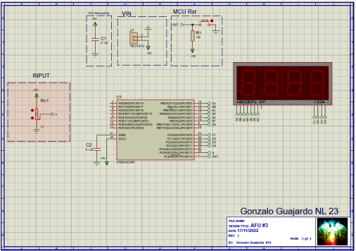

# 7-Segment Display Controlled by Atmega328P Microcontroller

## Overview
This project controls a 7-segment display using an Atmega328P microcontroller. The code reads an analog value from an ADC and displays different patterns on the display based on the input value.

## Components
- Atmega328P Microcontroller
- 7-Segment Display
- Analog-to-Digital Converter (ADC)

## Code Description
- **Libraries**: AVR standard libraries for I/O and interrupts are included.
- **Constants**: The oscillator frequency is defined.
- **Macros**: Macros are defined for port manipulation.
- **Functions**:
  - `init_ports()`: Initializes the microcontroller's ports.
  - `init_timer0()`: Initializes Timer0 for scanning the display.
  - `on_timer0()`: Turns on Timer0.
  - `off_timer0()`: Turns off Timer0.
  - `ADC_init()`: Initializes the Analog-to-Digital Converter.
  - `ADC_on()`: Turns on the Analog-to-Digital Converter.
- **Global Variables**: Variables for storing digit values and a counter variable.
- **Main Function (`main()`)**:
  - Initializes ports, Timer0, and ADC.
  - Enters an infinite loop where it reads ADC values and displays corresponding patterns on the 7-segment display.

## Usage
Connect the 7-segment display and ADC to the microcontroller as per the defined ports in the code. Power the circuit and observe the displayed patterns on the 7-segment display based on the ADC input.

## Compilation and Execution
- Use an AVR C compiler to compile the code.
- Upload the compiled binary to the Atmega328P microcontroller using a compatible programmer.

## Simulation in Proteus
This code was simulated using Proteus simulation software. The simulation setup included the Atmega328P microcontroller, the 7-segment display, and the ADC module.

The simulation demonstrated the following:
- Proper scanning and display of numbers on the 7-segment display based on simulated ADC input.

Above is a screenshot of the simulation in action, showing the display of different numbers on the 7-segment display.
